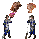
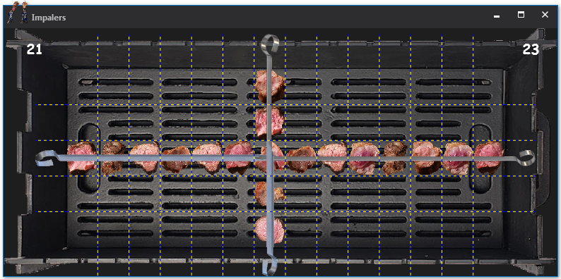
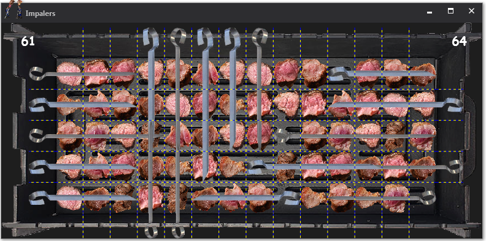

#  Impalers
### [Конкурс: Логические шашлыки](https://gamedev.ru/projects/forum/?id=237876)

#### Правила
 * За ход игрок может либо положить мясо, либо наколоть мясо на шампур
 * Мясо можно класть в любую свободную клетку
   * Дает 1 очко
 * Наколоть можно минимум 3 куска
   * Нельзя чтобы шампур проходил сквозь другой шампур
   * Но конец шампура может пересекаться с другим концом
   * Ручка шампура занимает свободную клетку в противоположном направлении
   * Дает (длина - 2) * 2 очков
 * 5 дополнительных очков за самый длинный шашлык 
 * 5 дополнительных очков за то что положил больше шашлыка чем оппонент
 
#### Управление
 * Клик мышкой - положить мясо
 * Зажать мышь -> Протянуть по нескольким кускам -> отпусть - наколоть мясо на шампур
 

## Eng (google translate):
​### Game for competition  [Logical kebabs](https://gamedev.ru/projects/forum/?id=237876)​​

#### Rules​
 * During the turn of the game the player can either put the meat, or impale the meat onto the skewer
 * Meat can be put in any free cell
   * Gives 1 point
 * You can impale at least 3 pieces
   * Do not allow the skewer to pass through another skewer
   * But the end of the skewer may intersect with the other skewer end
   * The handle of the skewer occupies a free cell in the opposite direction
   * Gives (length - 2) * 2 points
 * 5 extra points for the longest shish kebab
 * 5 extra points for putting more shashlik than opponent​

#### Control
 * Mouse click - put the meat
 * Press mouse -> Stretch in several pieces -> release - impale the meat into the skewer

-----
### OTHER
#### TOOLS USED
 * Visual Studio 2017
 * Photoshop CS2
 
 
#### ABOUT CODE
 * C#, WPF
 
 
#### SCREENSHOTS

